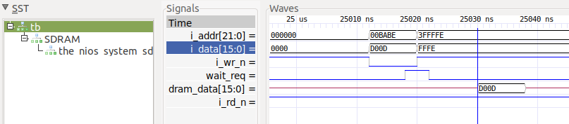
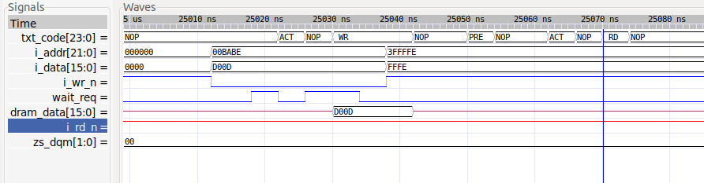
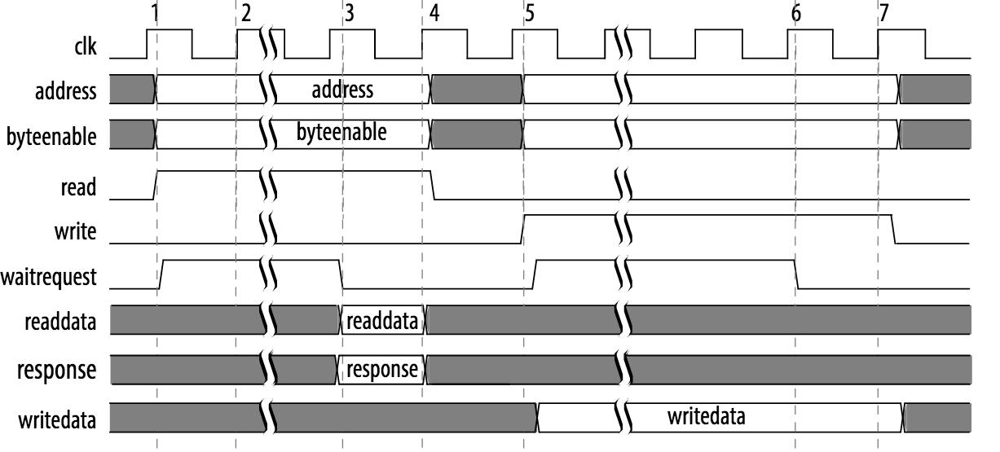

# Altera SDRAM memory controller with 2 entry EFIFO and AVALON Interface (old style) ?

I do not have a BFM for the simulation here, nor is the RTL written with any delays, so sim is a crap-shoot.  However, I have noticed that if incorrect timing is used with respect to WR# signal, then a spurious read will occur.

The RTL is not well documented, and I may or may not fix this later, but for now writes appear to be working.  No reads have been simulated due to lack of BFM.

