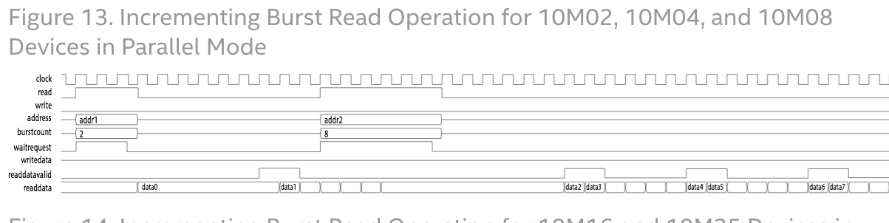

## Shadow rom copy
### Abandoned, because I couldn't figure out how to generate / flash the UFM independent of the POF/SOF file.  Looks like I'm stuck using Quartus
Copy the user flash memory from the altera FPGA into M9K dual-port RAM to use as ROM for our microcontroller.
* Why not just use the UFM directly?
1. You can flash UFM independently of the configuration memory (flash), which is how the internal M9K ROM gets programmed.
- In a nutshell, you don't need to fully re-synthesize your design just to change the microcontroller ROM.
2. The UFM is huge in comparison to the size of ROM we need.  If we're using UFM for CPU only this isn't a problem but I suspect we'll want to use it for other things.

### Avalon_MM burst read transaction.

